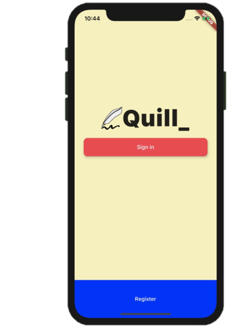
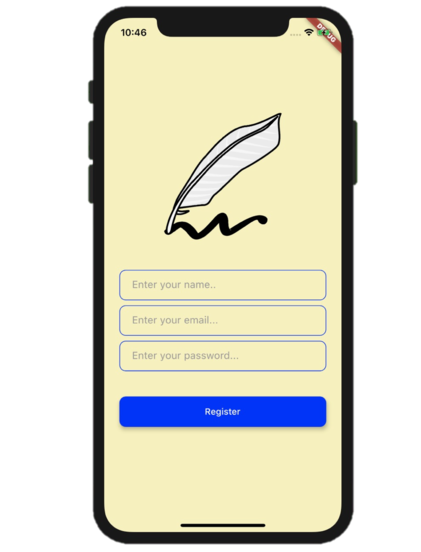
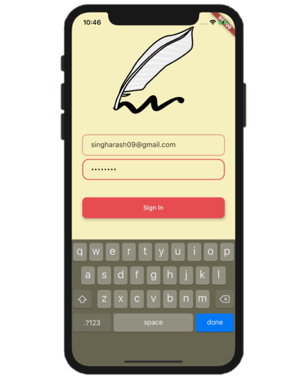
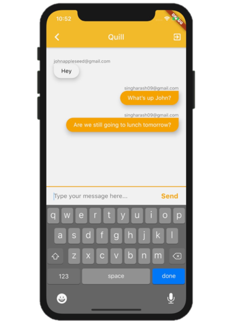
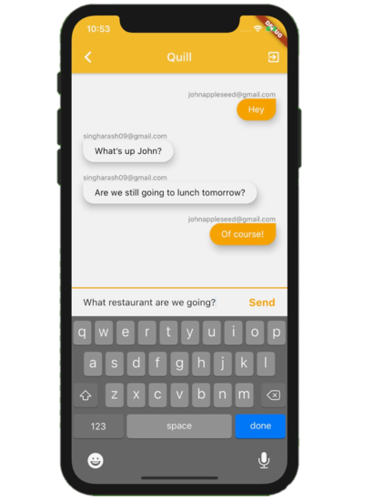

# Quill

Quill is a messaging mobile app that works on both iOS and Android built by the Flutter framework. Quill has user registration and authentication as well as messaging features.

## Technologies

The project was created with:

* Flutter SDK
* Dart
* Firebase Firestore
* Firebase Auth

## Requirements

To test this mobile application on a computer, make sure to do the following before cloning this repo to your local machine:

1) Use a MacOS computer in order to test the iOS version of the app. At the moment, the firestore database is only configured to work with iOS. Android database should soon be ready.

2) Install the flutter SDK by following the instructions here: https://flutter.dev/docs/get-started/install

3) To gain access to the firebase database, email me at mailto:singharash09@gmail.com with the subject "Quill database access request". I will answer the request as soon as possible.

## Usage

 

